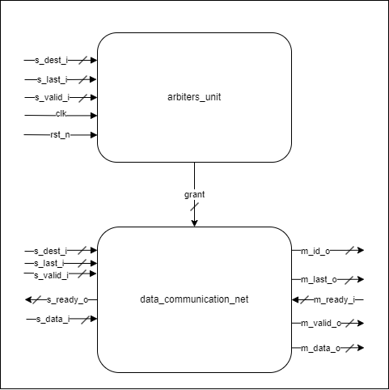

# STREAM CROSSBAR NxM

## Как запустить?
### Симуляция: make sim
Присутствуют флаги TEST и GUI. 
Можно выбрать 3 теста: 
1. crossbar_3x4  
В данном тесте выставляются значения на вход и ожидаемые значения на выходе. Они сравниваются. Результат об ошибках выводится в консоль. План проверки:  
	- Сброс
	- Параллельная работа всех мастеров.
	- 2 и 0 мастеры останавливливают свою работу (сигналы valid в 0).
	- 1 мастер останавливает свою работу (сигнал valid в 0). Отключение   			m_ready_i для 0-ого слэйва.
	- 1 и 2 мастер садятся на одного слэйва. 0 мастер не отпускает свой  valid после сигнала last.
	- 2 мастер посылает сигнал last.
	- Все мастеры на одном слэйве. Сменяют друга друга.
	- Постепенное прекращение работы.
	- Сброс
2. crossbar_3x3  
В данном тесте нет сравнений результатов и какой-либо проверки, и, следовательно, не выводятся сообщения об ошибках. Его можно запустить через GUI=1 и посмотреть временную диаграмму. Данный тест так и проверялся. 
Отличительное места в проверке: все мастеры запрашивают одного слэйва, имея valid и last в единице. Выходит так, что они сменяют друг друга постоянно.
3. crossbar_1x1  
Содерижит в себе assertion property на проверку s_ready. Результаты
выводятся в консоль.  
Информация о симуляции выводится в __.tmp/sim_out__
	

### Синтез: make synth 
Репорты выводятся в __.tmp/synth_out__
### Почистить: make clean  
Удаляется директория __./tmp__

__Примечание__  
Шапка топового модуля stream_xbar была изменена относительно заданной, посколько была проблема при выставлении кол-ва мастеров или слэйвов равным единице.

